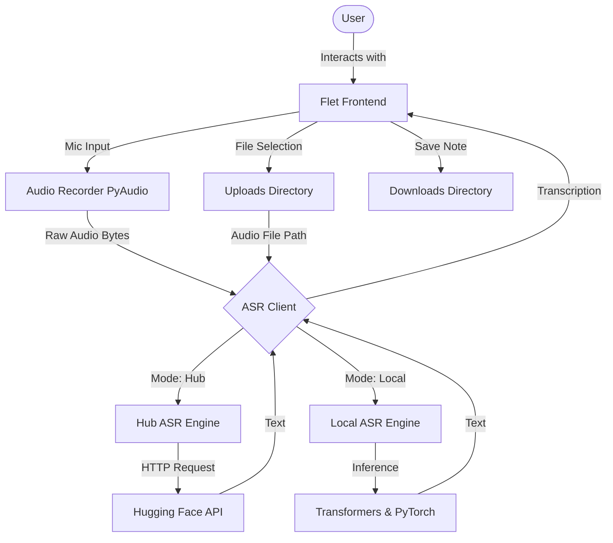

# ASR Notepad

## Table of Contents
- [Project Description](#project-description)
- [Architecture Description](#architecture-description)
- [Technologies Description](#technologies-description)
- [Installation](#installation)
- [Usage](#usage)
- [Features](#features)
- [API Documentation](#api-documentation)

## Project Description

**ASR Notepad** is an intelligent, web-based notepad application integrated with **Automatic Speech Recognition (ASR)** capabilities. It is designed to assist users in transcribing spoken audio into text in real-time or processing pre-recorded audio files. The application allows users to dictate notes seamlessly using their microphone or transcribe audio files (`.mp3`, `.wav`, `.flac`) present in the uploads directory. 

The primary motivation behind ASR Notepad is to boost productivity by providing a distraction-free environment for dictation and note-taking. To ensure flexibility and privacy, the application supports two operational modes:
- **Hub Mode**: Utilizes the Hugging Face Inference API for lightweight, cloud-based transcription.
- **Local Mode**: Uses a local PyTorch and Transformers pipeline to process audio directly on the user's machine, keeping data private and enabling offline capabilities.

By default, the application utilizes the robust `openai/whisper-large-v3-turbo` model for high-accuracy transcriptions.

## Architecture Description

The application follows a modular architecture consisting of the following key components:

- **Frontend (Flet UI)**: Manages the notepad interface, dialogs, settings, and user interactions.
- **Audio Recorder**: Uses `PyAudio` to capture real-time audio from the user's microphone on a background thread.
- **ASR Client**: A unified client that delegates transcription requests to the active ASR Engine.
- **ASR Engines**: 
  - `HubASREngine`: Communicates with the Hugging Face Inference API.
  - `LocalASREngine`: Loads the model natively via `transformers` and `torch`.



## Technologies Description

- **Python (3.11)**: The core programming language used for audio processing and application logic.
- **Flet**: A framework used to build the interactive web UI without needing frontend web development stacks.
- **PyAudio**: Used for capturing audio streams from the user's system microphone.
- **Hugging Face Hub**: Used for cloud-based inference to transcribe audio without heavy local computing requirements.
- **PyTorch & Transformers**: Used for local, offline machine learning model execution.
- **Docker & Docker Compose**: Used to containerize the application, managing complex system dependencies (like FFmpeg and ALSA).

## Installation

You can install and run the project either locally natively or using Docker. Docker is strongly recommended since audio processing requires system-level dependencies.

### Prerequisites
- Python 3.11+
- [Docker](https://docs.docker.com/get-docker/) & [Docker Compose](https://docs.docker.com/compose/install/)
- Hugging Face API Token (Required if using Hub mode)

### Option 1: Docker Installation (Recommended)

When using Docker, the container maps device drivers to capture audio from the host machine.

1. Clone the repository and navigate to the project directory.
2. Ensure you have the `downloads`, `uploads`, and `storage` folders created (they will be volume mapped).
3. Create a `.env` file in the project root to store your Hugging Face API key, or provide it directly at runtime.
   ```env
   # .env
   HUGGINGFACE_TOKEN_READ=your_hugging_face_token_here
   ```
4. Build and run the container using Docker Compose:
   ```bash
   docker-compose up -d --build
   ```
   *(Note: The `docker-compose.yml` mounts `/dev/snd` to capture host audio natively).*

### Option 2: Local Installation

If you wish to run the project natively without Docker:

1. Install system dependencies for audio handling:
   - **Linux/Ubuntu**: `sudo apt-get install ffmpeg libportaudio2 portaudio19-dev gcc python3-dev alsa-utils`
   - **Windows/Mac**: Install FFmpeg and verify PyAudio compatibility.
2. Install Python dependencies:
   ```bash
   pip install -r requirements.txt
   ```
3. Set your environment variables (create a `.env` file layout as detailed above).

## Usage

### Running the Application
- **Docker**: After running `docker-compose up -d`, open your browser and navigate to `http://localhost:8080`.
- **Local Native**: Run `python src/main.py`. This will open the Flet application locally.

### Application Guide
1. **Configuring Settings**: 
   - Click the **Settings (Gear Icon)** in the bottom right corner.
   - Enter your `Hugging Face API Key` if you wish to use Hub mode.
   - Toggle the **Local Mode** switch if you want to bypass the API and process transcription natively on your machine using GPU/CPU context.
2. **Recording Audio**:
   - Click the **Microphone Icon** below the notepad to start recording. Speak your notes.
   - Click the Microphone Icon (now red and a stop icon) again to finish. The app will process your speech and append the transcribed text to the notepad.
3. **Uploading Audio**:
   - Place audio files `.mp3`, `.wav`, or `.flac` into the `uploads/` folder mapping.
   - Click the **Upload (Folder) Icon**. Select your file from the dropdown and click "Transcribe".
4. **Managing Notes**:
   - Use the toolbar on top to clear the note, copy its contents to your clipboard, or **Download** the file directly to the `downloads/` directory.

## Features

- **Microphone Dictation**: Voice-to-text recording in real-time.
- **Audio File Transcription**: Easily transcribe existing media files.
- **Hybrid Inference Execution**: Switch effortlessly between cloud API (Hub) and local model inference depending on capability.
- **Notepad Toolkit**: Easily create, append, copy, or download text locally.
- **Dockerized Ready**: Fast deployment out of the box with `docker-compose`.

## API Documentation

*(Not Applicable)*

ASR Notepad is a standalone User Interface application and does not expose a local REST API endpoint for external HTTP requests or third-party web consumption. The application itself acts as a client connecting outwardly to internal pipelines (`transformers`) or cloud provider APIs (`Hugging Face Inference`).
