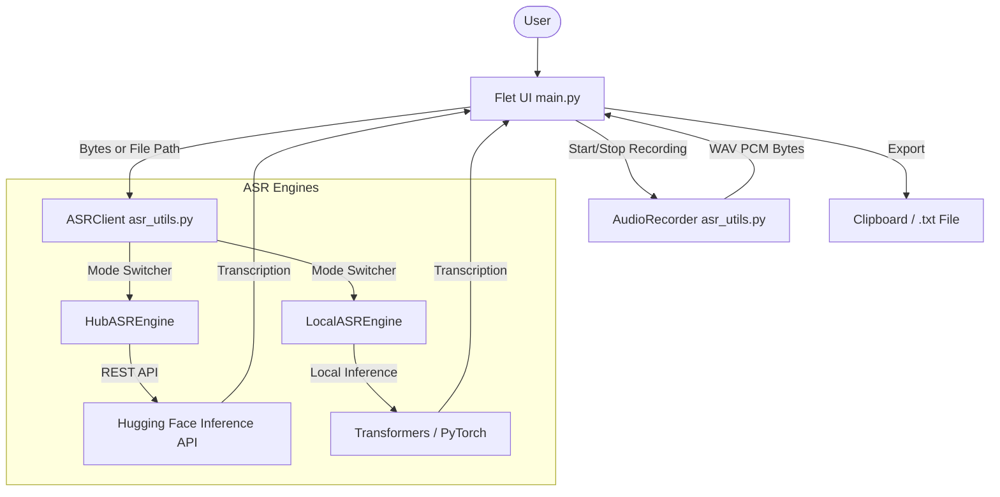

# ASR Notepad

ASR Notepad is a modern, cross-platform voice-to-text application designed to simplify note-taking through high-accuracy transcription. Built with Python and Flet, it offers a seamless experience for capturing ideas via microphone or audio file uploads, utilizing state-of-the-art **Whisper-large-v3-turbo** models.

## Project Description

The motivation behind **ASR Notepad** is to eliminate the friction of manual typing during meetings, lectures, or creative sessions. Many traditional note-taking apps lack integrated high-quality ASR (Automatic Speech Recognition), forcing users to switch between tools.

This project solves this by:
- Providing an intuitive "one-click" recording interface.
- Offering **dual-mode transcription**: Cloud-based (Hugging Face API) for speed or Local-based (Transformers) for privacy and offline use.
- Maintaining a clean, distraction-free notepad with export capabilities.
- Ensuring persistence of settings and API keys for a personalized workflow.

---

## Table of Contents
- [Architecture Description](#architecture-description)
- [Technologies Description](#technologies-description)
- [Installation](#installation)
- [Usage](#usage)
- [Features](#features)
- [Building the App](#building-the-app)

---

## Architecture Description

The application follows a modular architecture that decouple the user interface from the ASR processing logic, allowing for easy switching between local and cloud engines.

### Component Logic



### Key Modules:
- **`main.py`**: Manages the Flet application lifecycle, UI state, theme, and event-driven logic (recording, file picking, settings).
- **`AudioRecorder`**: Uses `PyAudio` to capture real-time audio in a background thread, ensuring the UI remains responsive.
- **`ASRClient`**: A factory/wrapper that dynamically routes transcription requests to either `HubASREngine` (cloud) or `LocalASREngine` (on-device).
- **`ASREngine` (Abstract)**: Defines the common interface for transcription, ensuring consistency across different backends.

---

## Technologies Description

| Technology | Role |
| :--- | :--- |
| **Python 3.9+** | The foundational programming language. |
| **Flet** | Flutter-based framework used for building the responsive desktop and web UI in Python. |
| **Whisper-large-v3-turbo** | The SOTA ASR model used for fast and accurate multilingual transcription. |
| **PyAudio** | Handles low-level microphone input and audio stream management. |
| **Hugging Face Hub** | Provides the `InferenceClient` for cloud-based transcription. |
| **Transformers & PyTorch** | Power the `LocalASREngine` for on-device inference. |
| **Python-dotenv** | Manages environment variables like `HUGGINGFACE_TOKEN_READ` and configuration persistence. |

---

## Installation

### Prerequisites
- **Python**: Version 3.9 or higher.
- **System Dependencies**:
  - **Windows**: [Microsoft C++ Build Tools](https://visualstudio.microsoft.com/visual-cpp-build-tools/) (required to compile `PyAudio`).
  - **Linux**: `libasound2-dev` and `python3-pyaudio`.
- **Hugging Face Token**: Required for Cloud (Hub) mode. [Get one here](https://huggingface.co/settings/tokens).

### Step-by-Step Setup

1. **Clone the repository**:
   ```bash
   git clone https://github.com/your-username/asr-notepad.git
   cd asr-notepad
   ```

2. **Install dependencies**:
   Using `uv` (recommended for speed):
   ```bash
   uv sync
   ```
   Or using `pip`:
   ```bash
   pip install -r requirements.txt
   ```

3. **Configure Environment Variables**:
   Create a `.env` file in the project root:
   ```env
   HUGGINGFACE_TOKEN_READ=your_hugging_face_token_here
   ```

---

## Usage

### Running the Application
From the project root, run:
```bash
# Desktop Mode (Default)
flet run src/main.py

# Web Mode
flet run --web src/main.py
```

### Operating Modes
- **Hub Mode**: Uses Hugging Face's infrastructure. Low local resource usage, requires an active internet connection and API token.
- **Local Mode**: Runs Whisper entirely on your machine. Higher resource usage (GPU recommended), but offers total privacy and offline capability.
- **Switching Modes**: Click the **Settings (Gear)** icon in the bottom-right corner to toggle between Local and Hub modes.

### Key Workflows
- **Voice Transcription**: Click the **MIC** button, speak, and click it again to stop and transcribe.
- **File Transcription**: Click the **UPLOAD** icon to select an existing audio file (`mp3`, `wav`, `flac`) for transcription.
- **Note Management**: Use the toolbar to create a **New Note**, **Copy to Clipboard**, or **Download** as a `.txt` file.

---

## Features

- 🎙️ **Live Voice Capture**: Integrated recording with real-time UI feedback.
- 📂 **Multi-Format Support**: Transcribe saved audio files seamlessly.
- ⚙️ **On-Device vs Cloud**: Flexible engine selection based on your hardware and privacy needs.
- 📋 **Rich Editor**: Multiline text editor for immediate refinement of transcribed text.
- 💾 **Persistence**: Automatically saves your ASR preference and API key to `.env`.
- 🎨 **Modern Design**: Clean Teal-themed interface with dedicated desktop and mobile layouts.

---

## Building the App

To package the application for your specific platform:

| Platform | Command |
| :--- | :--- |
| **Windows** | `flet build windows` |
| **macOS** | `flet build macos` |
| **Linux** | `flet build linux` |
| **Android/iOS** | `flet build apk` / `flet build ipa` |

For more options, refer to the [Flet Packaging Documentation](https://flet.dev/docs/publish/).
