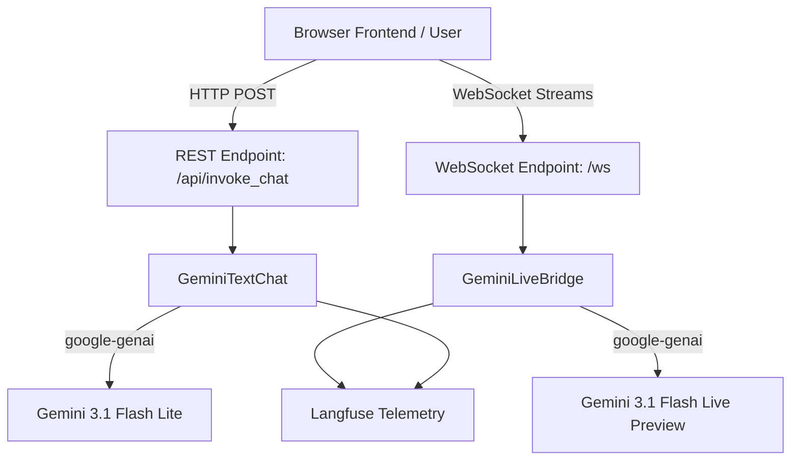

# Gemini Live Voice Agent

## Project Title
Gemini Live Voice Agent

## Project Description
The **Gemini Live Voice Agent** is a full-duplex, real-time voice and text interaction bridge powered by Google's cutting-edge Gemini Live AI models. By leveraging FastAPI and WebSockets, it provides a low-latency conduit between a client browser or application and the Google GenAI environment. 

The project solves the complexity of managing bidirectional audio streams, telemetry, and REST endpoints within a single concise architecture. This agent makes it seamless for developers seeking a robust boilerplate for real-time voice-to-voice generative AI, while simultaneously providing observability and a comprehensive Dockerized environment for production deployment.

## Architecture Description
The project employs a modern synchronous/asynchronous hybrid approach, using **FastAPI** as the central hub.



**Key Features to Note:**
- **Synchronicity:** Dual endpoint structure that serves static content, exposes REST endpoints for text generation, and maintains long-lived web socket connections for streaming audio.
- **Live Bridge (WebSocket):** Unpacks browser-originated PCM audio arrays, streams it directly fully-duplexed to Gemini Live, and repackages resulting binary frames back to the client while simultaneously broadcasting transcribed texts.
- **Telemetry Module:** Integrated telemetry automatically captures interactions (prompts, completion tokens, latency) via Langfuse.

## Technologies Description
- **Python 3.11:** Core execution language.
- **FastAPI / Uvicorn:** Provides a fast, lightweight, and asynchronous web framework.
- **WebSockets:** Underpins the real-time, bi-directional audio bridge.
- **Google GenAI SDK:** Official SDK for calling and streaming from Google models (`gemini-3.1-flash-live-preview`).
- **Langfuse:** For LLM observability and evaluation.
- **PyAudio:** Used internally for local execution/testing directly from CLI with hardware microphones.
- **Docker & Docker Compose:** Containerization, ensuring uniform deployment and resolving host-level audio dependency struggles dynamically.

## Table of Contents
- [Installation](#installation)
- [Usage](#usage)
- [Features](#features)
- [API Documentation](#api-documentation)

## Installation

### Prerequisites
- Docker & Docker Compose or Python 3.11+
- API Keys: Google Gemini API Key and Langfuse API Keys (Host, Public, Secret).

### Configuration
1. Clone the repository framework.
2. Ensure you have an appropriate `.env` file generated from the `.env.example` in the root directory.
   ```shell
   GOOGLE_API_KEY="your_google_api_key_here"
   LANGFUSE_PUBLIC_KEY="your_langfuse_public"
   LANGFUSE_SECRET_KEY="your_langfuse_secret"
   LANGFUSE_HOST="https://cloud.langfuse.com"
   ```

### Docker Installation (Recommended)
This method ensures all system-level audio dependencies (like PortAudio) are pre-installed.

1. Build and run the instance in detached mode.
   ```bash
   docker-compose up -d --build
   ```
2. The application will immediately run on host network `http://localhost:8000`.

### Local Installation
1. Install OS-level dependencies (Debian/Ubuntu example):
   ```bash
   sudo apt-get update
   sudo apt-get install -y gcc python3-dev portaudio19-dev libportaudio2
   ```
2. Set up the Python environment:
   ```bash
   pip install -r requirements.txt
   ```

## Usage

### Starting the Server
If running locally (not via Docker):
```bash
python main.py
```
This will start Uvicorn on `0.0.0.0:8000`.

### Interacting with the Application
- **Frontend GUI:** Open your browser and navigate to `http://localhost:8000`. Assuming your microphone has the right permissions, you can commence real-time chat testing directly on the website context.
- **Local CLI:** To use CLI interface interactions without a web browser interface, interact with the script bindings via `test_gemini_live.py`.

## Features
- **Real-Time Duplex Audio Routing:** Listen and emit simultaneously mimicking genuine voice responses natively.
- **Static File Serving Base:** Self-contained architecture that serves its custom web frontend.
- **Dual Inference Endpoints:** Separate classes for real-time multimodal audio and standard REST text invocations.
- **Observability Driven:** Full transaction tracing for conversational turns natively logged to Langfuse.
- **Production Standard Docker Environment:** Pre-configured constraints avoiding the notorious underlying Python package dependencies required by PyAudio.

## API Documentation

### 1. **Health Check Endpoint**
- **Endpoint:** `GET /api/status`
- **Description:** Verifies service uptime.
- **Response Example:**
  ```json
  {
      "status": "ok", 
      "service": "gemini-live-bridge"
  }
  ```

### 2. **Invoke Text Chat Endpoint**
- **Endpoint:** `POST /api/invoke_chat`
- **Description:** Transmits a standalone text snippet to GenAI and retrieves the complete generation paragraph.
- **Request Configuration:**
  - Content-Type: `application/json`
  - Body payload structure:
    ```json
    {
      "message": "Hello, how are you today?"
    }
    ```
- **Response Format:**
  ```json
  {
      "status": "success",
      "user_message": "Hello, how are you today?",
      "ai_response": "I am functioning flawlessly, how can I assist you further?"
  }
  ```

### 3. **Live Websocket Interaction**
- **Endpoint:** `WS /ws`
- **Description:** Stream binary `audio/pcm` payloads mapped to the `gemini-3.1-flash-live-preview` framework directly.
- **Protocol Details:** Send binary blobs of captured sound formats directly to the socket. Client connection disconnections gracefully terminate bridging operations behind the scenes.
