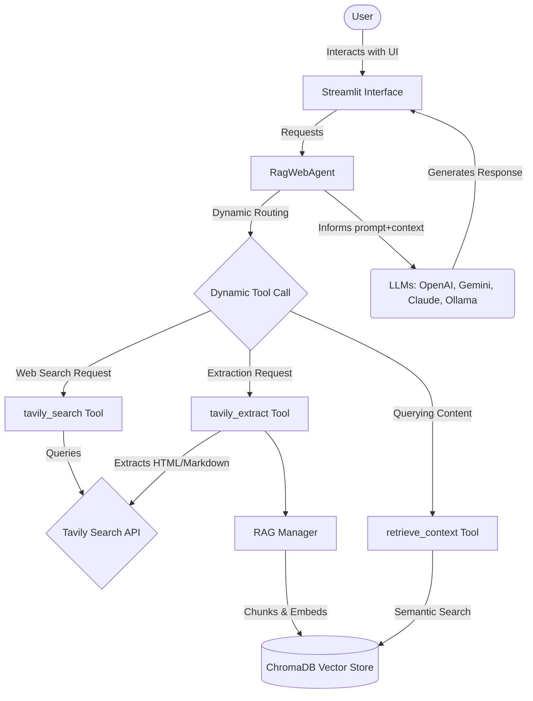

# 🔎 Project Title: AI-Powered Web Research Assistant

## Project Description
The **AI-Powered Web Research Assistant** is an advanced interactive application designed to simplify web research by leveraging the analytical power of Large Language Models (LLMs) and advanced Retrieval-Augmented Generation (RAG) paradigms. It solves the recurrent problem of information overload during web searches; it doesn't just present a list of search links but effectively reads, indexes, and allows you to chat directly with multiple web pages concurrently. Consequently, it accelerates the information-gathering phase for users, analysts, and developers.

## Architecture Description
The underlying foundation of this dynamic application implements a custom conversational agentic workflow using LangChain and LangGraph alongside a Streamlit interactive frontend.



The app processes requests iteratively, maintaining ephemeral context memory across web discovery steps before indexing data into ChromaDB to ensure that subsequent semantic Q&A queries remain contextual relative to only your selected URLs.

## Technologies Description
- **Streamlit**: Main module used to power the user-friendly Web Interface.
- **LangChain & LangGraph**: The core orchestration framework responsible for defining the agent topology, strict tool binding routines, and context management checkpoints. 
- **Tavily AI**: Adopted for advanced and customizable Web searching and detailed verbatim extraction of markdown text from webpages.
- **ChromaDB**: Employed as the robust back-bone Vector Store to handle the local, lightweight database management and chunking process algorithm for Extracted RAG.
- **HuggingFace Sentences-Transformers**: Dedicated tool enabling qualitative embedding calculations to augment local vector storage properties.
- **Docker**: Included to streamline execution dependencies seamlessly minimizing environment setups across OS architectures.

## Table of Contents
- [Installation](#installation)
- [Usage](#usage)
- [Features](#features)
- [API Documentation](#api-documentation)

## Installation
You can configure and begin running this project locally either natively on your machine or within a container environment. 

### Prerequisites
- Python 3.10+ (for local environment setup)
- Docker and Docker Compose (if installing inside a container structure)
- Valid API Keys for **Tavily**, and your selected LLM Provider (e.g. OpenAI, Google, Anthropic)

### Option 1: Local Installation 
1. **Clone the repository** and navigate into the directory:
   ```bash
   git clone <repository-url>
   cd Rag_Web
   ```
2. **Create and Activate a Virtual Environment**:
   ```bash
   python -m venv venv
   source venv/bin/activate  # On Windows use: venv\Scripts\activate
   ```
3. **Install Dependencies**:
   ```bash
   pip install -r requirements.txt
   ```
4. **Environment Configuration**: Set up application secrets inside an `.env` file (saved specifically as `apy_keys.env` based on module requests), though keys can interchangeably be imported simply in the Web UI on boot up.
5. **Start Application**:
   ```bash
   streamlit run streamlit_app.py
   ```

### Option 2: Docker Installation
The application fully adopts containerized strategies to isolate module distributions via unified images.

1. **Clone the repository**:
   ```bash
   git clone <repository-url>
   cd Rag_Web
   ```
2. **Deploy Application Engine**:
   ```bash
   docker-compose up --build
   ```
   This command pulls Python image foundations, generates virtual environment dependencies mapping container volumes, and exposes Streamlit server ports smoothly.

## Usage
Once the environment finishes loading, access the interface through your web browser typically pointing to `http://localhost:8501`.

1. **Submit API Credentials**: Expand your Sidebar **Settings**. To unleash querying capabilities, verify you add a valid **Tavily API Key** to allow external engine parsing, along with selecting whichever Model provider network your workspace favors. Click **Save Settings** to synchronize states.
2. **Launch a Search Instance**: Enter any topic string query alongside adjusting temporal/location constraints via the settings dropdown menu in the search panel. 
3. **Parse and Screen Targets**: Evaluate AI Web Results mapping outputting distinct platform summaries. Deselect any URL that seems untrustworthy from your query pool checklists visually.
4. **Content Induction**: Initialize "**Extract Info and Chat**". This triggers localized embedding processes transforming raw strings onto embedded vector representations exclusively loading into a fresh DB memory cycle. 
5. **Interactive Feedback Generation**: Leverage bottom console chat inputs querying granular questions requiring analytical conclusions directly verified by RAG context windows seamlessly. 

## Features
- **Configurable LLM Backends**: Swift interface selection enabling the adoption of numerous large language platforms incorporating Open-Source frameworks like Ollama or commercial layers (Google Gemini, OpenAI, Claude).
- **Inertial Search Filters**: Parameterized depth filtering adjusting time metrics, excluded domains, and location bounds interactively.
- **Direct Output Tracking (Langsmith)**: Offers diagnostic trace switches validating LLM latency benchmarks and Langchain memory behavior paths seamlessly.
- **Granular Memory Scoping:** Vector databases are completely erased and re-instantiated upon distinct domain crawls avoiding memory bleed/hallucinations sequentially.
- **Multi-Source Ingestion Pipeline**: Integrates robust semantic chunking limits resolving dynamic content volumes properly fitting generative constraints cleanly.

## API Documentation
The current platform natively exposes operations to visual users operating as a cohesive end-to-end web client via Streamlit; it does not deploy explicit decoupled standard HTTP logic endpoints (GET, POST, PUT, DELETE REST architectures do not apply). 

However, programmatic manipulation translates to importing class variables locally through the initialized `RagWebAgent` within `agent.py` acting effectively as your Python modular API:

- **`invoke_agent(query: str, tool_type: str, thread_id: str)`** 
  Executes synchronous one-turn queries explicitly restricting dynamic router capabilities natively.
- **`web_search(research_query: str, params: dict)`** 
  Constructs parameters and yields a Python tuple defining summary overviews coupled with nested lists describing retrieved resources accurately.
- **`web_extract(urls: List[str])`** 
  Issues array mapping and responds heavily detailed unedited verbatim responses directly pulled off given list nodes natively. 
- **`ingest_documents(extracted_results: List[dict], thread_id: str)`** 
  Issues destructive resets dropping native document databases ensuring prompt scopes replace stale RAG items immediately preceding extraction mapping safely.
- **`chat_stream(query: str, thread_id: str)`** 
  Initializes token-by-token Python iterators allowing conversational responses maintaining strict LLM-RAG bounded properties locally formatted as string chunk arrays. 

