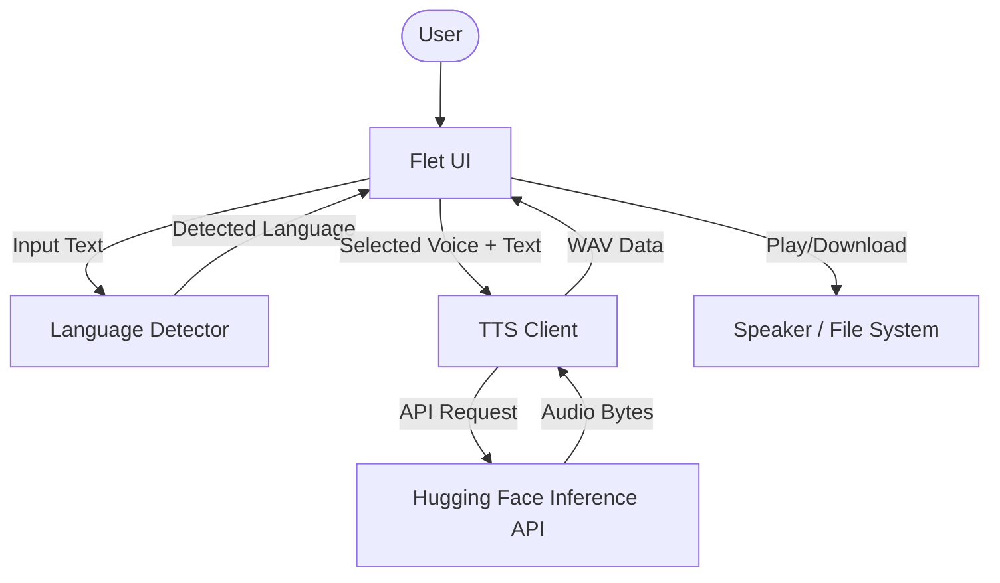

# Text2Speech Kokoro82M

A high-performance, modern Text-to-Speech (TTS) application built with **Flet** and powered by the **Kokoro-82M** AI model. This tool enables users to convert text into natural-sounding speech across multiple languages with automatic language detection.

## Project Description

**Text2Speech Kokoro82M** is designed to provide a seamless and accessible interface for generating high-quality audio from text. Whether you're a developer looking for a local TTS solution or a user needing to convert documents into speech, this application offers:

*   **Natural Audio**: Leveraging the [Kokoro-82M](https://huggingface.co/hexgrad/Kokoro-82M) model for lifelike pronunciation and intonation.
*   **Intelligent Detection**: Automatic language sensing to streamline the voice selection process.
*   **Multi-Modal Input**: Support for direct text entry and `.txt` file uploads.
*   **Export Capabilities**: Play generated audio directly or download it as a `.wav` file for external use.

The project solves the problem of complex TTS setups by providing a simple, ready-to-run UI that handles model orchestration behind the scenes.

---

## Architecture Description

The application follows a modular architecture that separates the UI layer from the language processing and TTS engine.

### System Workflow

1.  **Input Layer**: User provides text through the Flet UI (Text Box or File Upload).
2.  **Detection Layer**: The `LanguageDetector` uses the `langdetect` library to identify the primary language.
3.  **Voice Mapping**: Based on the detected language, the system filters available voices from the `VOICES.md` configuration.
4.  **Synthesis Layer**: The `TTSClient` communicates with the Hugging Face Inference API to generate audio.
5.  **Output Layer**: Audio is streamed back to the UI for playback or local download.

### Architecture Diagram



---

## Technologies Description

| Technology | Role |
| :--- | :--- |
| **Python** | Core programming language for logic and integration. |
| **Flet** | Flutter-based framework used for building the cross-platform UI. |
| **Kokoro-82M** | The underlying AI model optimized for high-quality TTS. |
| **Hugging Face Hub** | Provides the Inference API for remote model execution. |
| **langdetect** | Library for automatic language identification. |
| **uv / Poetry** | Modern dependency management and project environment runners. |

---

## Table of Contents

- [Text2Speech Kokoro82M](#text2speech-kokoro82m)
  - [Project Description](#project-description)
  - [Architecture Description](#architecture-description)
    - [System Workflow](#system-workflow)
    - [Architecture Diagram](#architecture-diagram)
  - [Technologies Description](#technologies-description)
  - [Table of Contents](#table-of-contents)
  - [Installation](#installation)
    - [Prerequisites](#prerequisites)
    - [Setup with uv (Recommended)](#setup-with-uv-recommended)
    - [Setup with Poetry](#setup-with-poetry)
    - [Setup with Docker](#setup-with-docker)
  - [Usage](#usage)
    - [Running the Application](#running-the-application)
    - [Using the Interface](#using-the-interface)
    - [Key Configuration (Environment Variables)](#key-configuration-environment-variables)
  - [Features](#features)

---

## Installation

### Prerequisites

- **Python**: Version 3.9 or higher.
- **Hugging Face Account**: You need a token to access the Inference API.
- **Environment Variable**: Set `HF_TOKEN_READ` in your system or `.env` file.

### Setup with uv (Recommended)

1.  **Clone the repository**:
    ```bash
    git clone <repository-url>
    cd TTS_Kokoro82M
    ```
2.  **Install dependencies and run**:
    ```bash
    uv run flet run
    ```

### Setup with Poetry

    ```bash
    poetry run flet run
    ```

### Setup with Docker

The application is containerized for production readiness using a lightweight Python image.

#### Prerequisites
- **Docker** and **Docker Compose** installed on your system.
- Your Hugging Face token ready.

#### 1. Configure your environment
Create a `.env` file in the root directory (or set the environment variable on your host):
```env
HF_TOKEN_READ=your_huggingface_token_here
```

#### 2. Run with Docker Compose (Recommended)
This is the easiest way to start the application with its configuration:
```bash
docker-compose up --build
```
The application will be accessible at [http://localhost:8080](http://localhost:8080).

#### 3. Run with Docker CLI
If you prefer building and running the image manually:
```bash
# Build the image
sudo docker build --no-cache -t tts-kokoro82m:v6.2 .

# Run the container with Volumes for persistent downloads and uploads
sudo docker run -d \
  -p 8080:8080 \
  --name tts_container \
  -v $(pwd)/downloads:/app/downloads \
  -v $(pwd)/uploads:/app/uploads \
  -e HF_TOKEN_READ="your_token_here" \
  tts-kokoro82m:v6.2
```

> [!TIP]
> **File Persistence**: By mapping the `downloads` folder with the `-v` parameter, you will find all generated audio files directly on your host machine in the `downloads` subfolder.

---

## Usage

### Running the Application

- **Desktop App**: `flet run` (standard mode).
- **Web App**: `flet run --web` (runs in your default browser).

### Using the Interface

1.  **Choose Mode**: Select "Insert Text" for manual typing or "Upload Text File" to select a `.txt` file.
2.  **Enter Text**: Type your text or upload a file. The application will automatically detect the language.
3.  **Select Voice**: Ensure the detected language is correct and pick a voice from the dropdown. 
4.  **Convert**: Click **"Convert to Speech"**. A notification will appear when the audio is ready.
5.  **Interact**: Use the **Mic icon** to play the audio and the **Download icon** to save the `.wav` file.

### Key Configuration (Environment Variables)

Ensure your Hugging Face token is exported:
```powershell
# Windows (PowerShell)
$env:HF_TOKEN_READ = "your_token_here"

# Linux/macOS
export HF_TOKEN_READ="your_token_here"
```

---

## Features

- **AI-Powered Synthesis**: High-fidelity text-to-speech using the Kokoro-82M model.
- **Automatic Language Detection**: Seamlessly switches voice options based on the input text language (English, Japanese, French, etc.).
- **Dual Input Modes**: Quickly toggle between copy-pasting text and uploading documents.
- **Real-time Playback**: Listen to the generated speech instantly within the app.
- **Offline Export**: Save your generated speech as high-quality WAV files.
- **Cross-Platform**: Ready to be built for Windows, macOS, Linux, Android, and iOS via Flet's packaging system.
